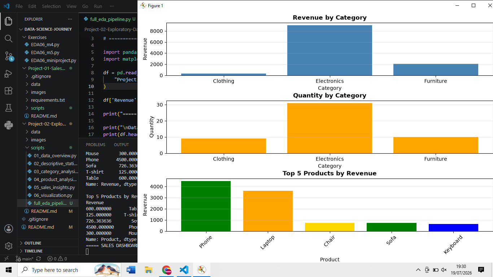

# 📊 Project 02 — Exploratory Data Analysis

## Objective

Perform Exploratory Data Analysis (EDA) on a cleaned sales dataset using Pandas and Matplotlib.

---

## Dataset

Sales Dataset (Cleaned)

Columns:

- Product
- Category
- Price
- Quantity

---

## Folder Structure

```
Project-02-Exploratory-Data-Analysis
│
├── data
├── scripts
├── images
└── README.md
```

---

## Topics Covered

- Dataset Inspection
- Summary Statistics
- GroupBy Aggregation
- Category Analysis
- Product Analysis
- Sales Insights
- Data Visualization

---

## Dashboard Preview



---

## Key Insights

- Electronics generated the highest revenue.
- Electronics sold the largest quantity.
- Phone produced the highest revenue among all products.
- Clothing contributed the lowest overall revenue.

---

## Skills Gained

- Exploratory Data Analysis (EDA)
- Pandas Aggregation
- GroupBy Analysis
- Business Insights
- Revenue Analysis
- Category Analysis
- Product Analysis
- Data Visualization
- Dashboard Creation
- Matplotlib

---

## Technologies

- Python
- Pandas
- Matplotlib